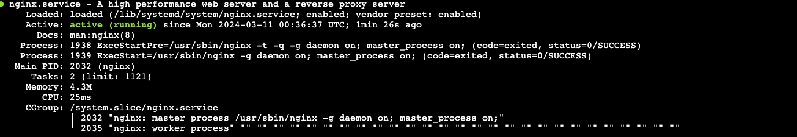
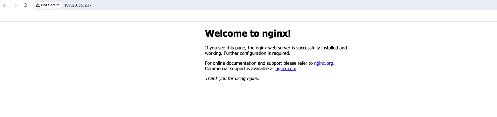
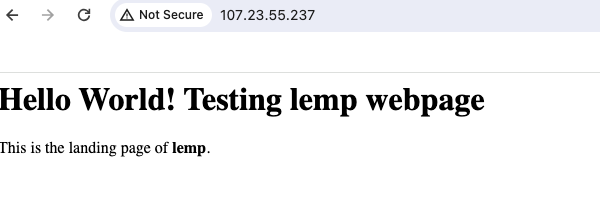

# How To Install Linux, NginX, MySQL, PHP (LEMP) Stack on Ubuntu 22.04

## Project Overview: 

This project aims to develop a web-based application using the LAMP stack. The LAMP (Linux, Nginx, MySQL, PHP/Perl/Python) stack is a popular open-source web development platform used for building dynamic websites and web applications. 

## Prerequisites:
- AWS EC2 Instance: An EC2 instance will be used as the hosting environment for the LAMP stack. It provides scalability and flexibility for web development projects.

- AWS Security Group Configuration: Ensure that all traffic is allowed in the AWS Security Group associated with your EC2 instance. However, this is not a recommended practice for production environments, and security configurations should be adjusted accordingly.

- Choose Ubuntu OS: Select Ubuntu as the operating system when configuring your EC2 instance. Ubuntu is widely used and well-supported, making it a suitable choice for hosting web applications.


## Step-by-Step Implementation:

### Step 1 - Installing nginn 

- Update package manager

```
sudo apt update
```

- Istall nginx:

```
sudo apt install nginx
```

You’ll be prompted to confirm nginx’s installation. Confirm by pressing Y, then ENTER.

- After installation, verify the status of nginx:

```
sudo systemctl status nginx
```




- Test nginx installation by accessing your server’s public IP address in your web browser:

```
http://your_server_ip
```



### Step 2 — Installing MySQL

Now that Nginx web server is up and running, a database system needs to be installed to store and manage data for your site. MySQL is a popular database management system used within PHP environments.

- Install MySQL Server:

```
sudo apt install mysql-server
```


When prompted, confirm installation by typing Y, and then ENTER.

When the installation is finished, it’s recommended that you run a security script that comes pre-installed with MySQL. This script will remove some insecure default settings and lock down access to your database system.

- Open up MYSQL Prompt

```
sudo mysql
```

- Then run the following **ALTER USER** command to change the root user’s authentication method to one that uses a password. The following example changes the authentication method to **mysql_native_password**:

```
ALTER USER 'root'@'localhost' IDENTIFIED WITH mysql_native_password BY 'password';
```

- After making this change, exit the MySQL prompt:

```
exit
```

- Start the interactive script by running:

```
sudo mysql_secure_installation
```

This will ask if you want to configure the **VALIDATE PASSWORD PLUGIN**.

Note: Enabling this feature is something of a judgment call. If enabled, passwords which don’t match the specified criteria will be rejected by MySQL with an error. It is safe to leave validation disabled, but you should always use strong, unique passwords for database credentials.

When prompted, confirm installation by typing Y, and then ENTER to series of question regarding removal of anonymous user and test database.

## Step 3 — Installing PHP

Having installed Nginx to serve content and MySQL to store and manage data, PHP is next component of which processes code to display dynamic content to the end user. Nginx requires an external program to handle PHP processing and act as a bridge between the PHP interpreter itself and the web server. This allows for better overall performance in most PHP-based websites, but it requires additional configuration. You’ll need to install php8.1-fpm, which stands for “PHP fastCGI process manager” and uses the current version of PHP, to tell Nginx to pass PHP requests to this software for processing.  In addition to the php package, we will install php-mysql, a PHP module that allows PHP to communicate with MySQL-based databases and also install libapache2-mod-php to enable Apache to handle PHP files.

- To install these packages, run the following command:

```
sudo apt install php8.1-fpm php-mysql
```
- Once the installation is finished, run the following command to confirm your PHP version:

```
php -v
````

**Output**


LEMP stack is now fully operational, but before testing the setup with a PHP script, it’s best to set up a proper nginx Virtual Host to hold your website’s files and folders.


### Step 4 — Configuring Nginx to Use the PHP Processor

When using the Nginx web server, you can create server blocks to encapsulate configuration details and host more than one domain from a single server. we’ll set up a domain called lemp.

Nginx on Ubuntu 22.04 has one server block enabled by default that is configured to serve documents from the /var/www/html directory. While this works well for a single site, it can become difficult to manage if you are hosting multiple sites. Instead of modifying /var/www/html, we’ll create a directory structure within /var/www for the lemp site, leaving /var/www/html in place as the default directory to be served if a client request doesn’t match any other sites.

- Create the directory for lemp domain as follows:

```
sudo mkdir /var/www/lemp
```

Next, assign ownership of the directory with the $USER environment variable, which will reference your current system user:

```
sudo chown -R $USER:$USER /var/www/lemp
```

- Then, open a new configuration file in Nginx’s sites-available directory using your preferred command-line editor. Here, we’ll use vim:

```
sudo vi /etc/nginx/sites-available/lemp
```

- This will create a new blank file. Add in the following bare-bones configuration with your own domain name: 


```
server {
    listen 80;
    server_name lemp www.lemp;
    root /var/www/lemp;

    index index.html index.htm index.php;

    location / {
        try_files $uri $uri/ =404;
    }

    location ~ \.php$ {
        include snippets/fastcgi-php.conf;
        fastcgi_pass unix:/var/run/php/php8.1-fpm.sock;
     }

    location ~ /\.ht {
        deny all;
    }

}
```

Save and close the file when you’re done. If you’re using vim, do that by pressing escape, :wq then ENTER.


- Activate your configuration by linking to the configuration file from Nginx’s sites-enabled directory:

```
sudo ln -s /etc/nginx/sites-available/lemp /etc/nginx/sites-enabled/
```

- Then, unlink the default configuration file from the /sites-enabled/ directory:

```
sudo unlink /etc/nginx/sites-enabled/default
```

- Test your configuration for syntax errors by running the following:

```
sudo nginx -t
```
If you get the output below, you are good to go

`nginx: the configuration file /etc/nginx/nginx.conf syntax is ok
nginx: configuration file /etc/nginx/nginx.conf test is successful`

- Reload Nginx so these changes take effect:

```
sudo systemctl reload nginx
```

Your new website is now active, but the web root /var/www/lemp is still empty. Create an index.html file in that location to test that the server block works as expected:

```
sudo vi /var/www/lemp/index.html
```

- Include the following content in this file:
```
<html>
  <head>
    <title>lemp website</title>
  </head>
  <body>
    <h1>Hello World! Testing lemp webpage</h1>

    <p>This is the landing page of <strong>lemp</strong>.</p>
  </body>
</html>
```

- Go to your browser and access your server’s domain name or IP address:

```
http://server_domain_or_IP
```



## Step 5 — Testing PHP with Nginx

Now that you have a custom location to host your website’s files and folders, create a PHP test script to confirm that Nginx is able to handle and process requests for PHP files.

- Create a new file named info.php inside your custom web root folder:

```
sudo vi /var/www/lemp/info.php
```

- This will open a blank file. Add the following text, which is valid PHP code, inside the file:

```
<?php
phpinfo();
```
When you are done, save and close the file.

To test this script, go to your web browser and access your server’s domain name or IP address, followed by the script name, which in this case is /info.php:

```
http://server_domain_or_IP/info.php
```


Conclusion: 

In this guide, we’ve successfully installed and configured the LEMP stack on Ubuntu 22.04, providing a robust foundation for web development. With Linux as the operating system, NginX as the web server, MySQL as the database management system, and PHP as the server-side scripting language, we have a versatile platform for building dynamic websites and web applications.

Note: don't forget to terminate your ec2 instance, once you are done implementing this project. 

**Project Complete**