# Scalable 3-Tier Web Application with NFS and Load Balancing

## Project Overview: 

This project aims to create a scalable architecture for hosting a three-tier web application on AWS. This architecture utilizes Amazon Linux for the web servers, Ubuntu with MySQL for the database server, and Amazon Linux for the NFS storage server. The project leverages AWS services for its infrastructure needs, including EC2 instances, EBS volumes, NFS, and LoadBalancer.

The architecture follows a three-tier approach, with stateless web servers accessing a shared database and files stored on an NFS server. This setup ensures high availability, scalability, and fault tolerance for the web application.

## Prerequisites:

- Infrastructure: AWS
- Webserver Linux: Redhat Enterprise Linux 8
- Database Server: Ubuntu 20.04 + MySQL
- Storage Server: Redhat Enterprise Linux 8 + NFS Server
- Programming Language: PHP
- Code Repository: Github


*the image above shows 3 stateless Web Servers sharing a common database and also accessing same files using Network File System as a shared filed storage*

## Step-by-Step Implementation:

### Step 1 - Launch and Configure NFS Server

- In AWS, launch an EC2 instance with Amazon Linux and name it "NFS."

- Create and attach three EBS volumes to the NFS server.

### Step 2 - Create and Mount  Logical Volumes on NFS Server:

- Use the `gdisk utility` to create a single partition on each EBS volume. Follow the interactive prompts to create partitions

```
sudo gdisk /dev/xvdbf 
sudo gdisk /dev/xvdbg
sudo gdisk /dev/xvdbh
```

- Install lvm2 package using;

```
sudo yum install lvm2  -y
```

- Use pvcreate utility to mark each of 3 disks as physical volumes (PVs) to be used by LVM

```
sudo pvcreate /dev/xvdbf1
sudo pvcreate /dev/xvdbg1
sudo pvcreate /dev/xvdbh1
```

- Use `vgcreate utility` to add all 3 PVs to a volume group (VG). Named webdata-vg.

```
sudo vgcreate webdata-vg /dev/xvdbf1 /dev/xvdbg1 /dev/xvdbh1
```

- Use `lvcreate utility` to create 3 logical volumes. `opt-Lv` `apps-Lv`, and `logs-Lv`

```
sudo lvcreate -n apps-lv -L 9G webdata-vg
sudo lvcreate -n logs-lv -L 9G webdata-vg
sudo lvcreate -n opt-lv  -L 9G webdata-vg
```


- Use mkfs.xfs to format the logical volumes with xfs filesystem

```
sudo mkfs.xfs /dev/webdata-vg/apps-lv
sudo mkfs.xfs /dev/webdata-vg/logs-lv
sudo mkfs.xfs /dev/webdata-vg/opt-lv
```

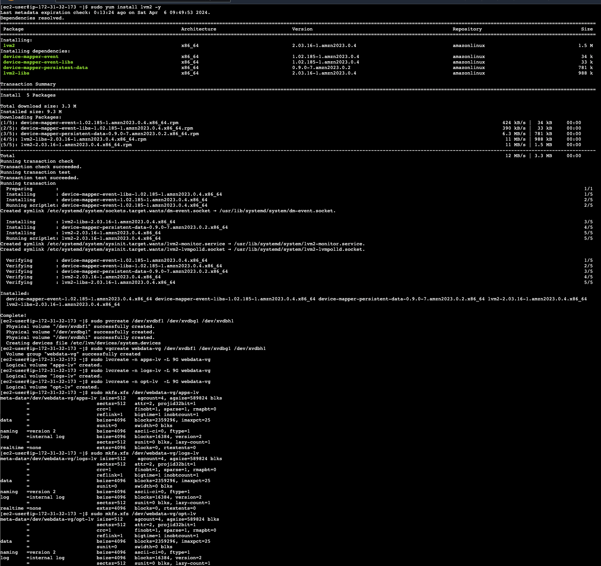

_the image above shows the steps taken so far_

- Creat mount point on /mnt directory , for the logical volumes as follows:

```
sudo mkdir -p /mnt/apps
sudo mkdir -p /mnt/logs
sudo mkdir -p /mnt/opt
```
 for webserver, webserver logs and jekins server respectively.

- Mount apps-lv on /mnt/apps

 ```
sudo mount /dev/webdata-vg/apps-lv /mnt/apps
 ```

- Mount logs-lv on /mnt/logs
 
 ```
sudo mount /dev/webdata-vg/logs-lv /mnt/logs
 ```

 - Mount opt-lv on /mnt/opt
 
 ```
sudo mount /dev/webdata-vg/opt-lv /mnt/opt
 ``` 

- Confirm mount with:

 ```
 df -h
 ```


- Use the command  below to view the UUID of the device in other to copy and update the fstab

```
sudo blkid
```

- Update the fstab with the UUID 

```
sudo vi /etc/fstab
```

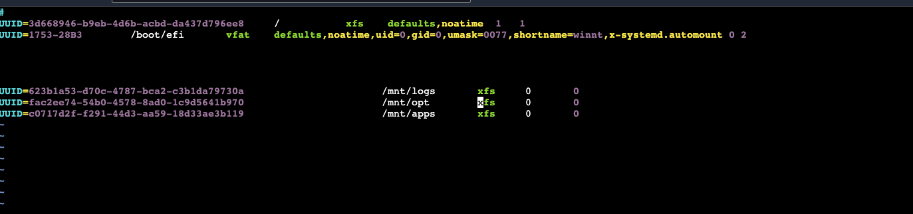

- Save and close the fstab file

- Verify that the mount configurations work as expected:

```
sudo mount -a
```
If you don't get any feedback this means the configuration is okay.

- Restart the systemd service to pick up changes:

```
sudo systemctl daemon-reload
```

### Step 3 Install and Configure NFS Server 

- Update the Package list and install nfs server:

```
sudo yum update -y
sudo yum install nfs-utils -y
sudo systemctl start nfs-server.service
sudo systemctl enable nfs-server.service
sudo systemctl status nfs-server.service
```

_ensure you confirm the status of your nfs server_


- Extract the subnet cidr for NFS on the EC2, by locating the 'Networking' tab and open the Subnet link.

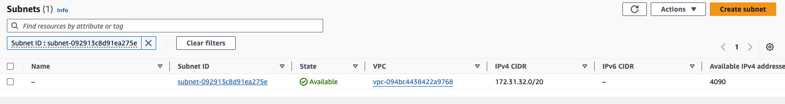


- setting up neccessary permissions:

```
sudo chown -R nobody: /mnt/apps
sudo chown -R nobody: /mnt/logs
sudo chown -R nobody: /mnt/opt

sudo chmod -R 777 /mnt/apps
sudo chmod -R 777 /mnt/logs
sudo chmod -R 777 /mnt/opt

sudo systemctl restart nfs-server.service
```


- Configure access to NFS for clients within the same subnet

```
sudo vi /etc/exports
```

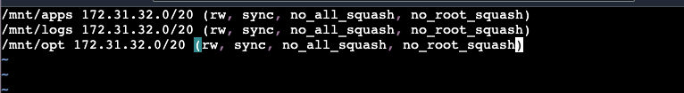

*the image above shows the configuration access to NFS for clients within the same subnet*

- Then use the command below to export it so that the web servers can access it when trying to connect. 

```
sudo exportfs -arv
```

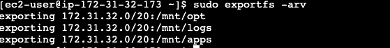

- Checked the port used by the NFS in other to configure the security group (Added New Inbound Rules). 

```
rpcinfo -p | grep nfs
``` 

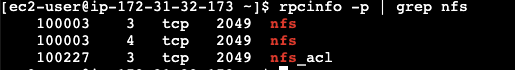

- However, in other for NfS server to be accessible by the client the following ports: TCP 111, UDP 111, UDP 2049 should be created in NFS security group inbound rules as seen below:

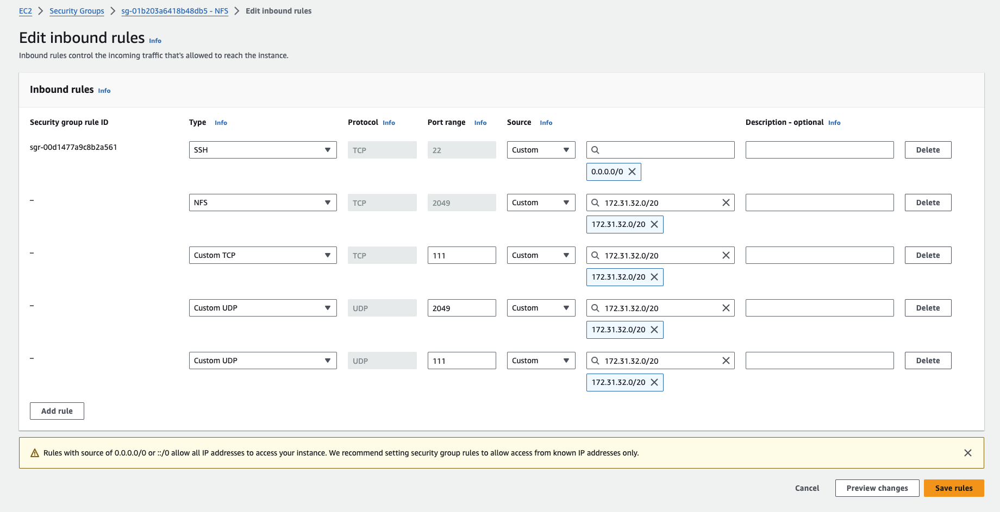


### Step 4 - Set Up Database Server.

- Launch a new Ec2 Instance with ubuntu OS and tag it DB (short for DATABASE) 

- Connect to the DB instance 

- Install and configure mysql-server

```
sudo apt install mysql-server -y
sudo systemctl start mysql 
sudo systemctl enable mysql 
sudo systemctl status mysql
```

- log into the mysql console


```
sudo mysql
```
- Create a database and name it tooling

```
CREATE DATABASE tooling;
```

- Create a database user and name it webaccess

```
CREATE USER 'webaccess'@'%' IDENTIFIED BY 'Password200.';
```

- Grant permission to webaccess user on tooling database

```
GRANT ALL PRIVILEGES ON tooling.* TO 'webaccess'@'%' WITH GRANT OPTION; 
```

- Verify that the user and database are created successfully.

```
SELECT USER,HOST FROM mysql.user;
SHOW DATABASES;
```

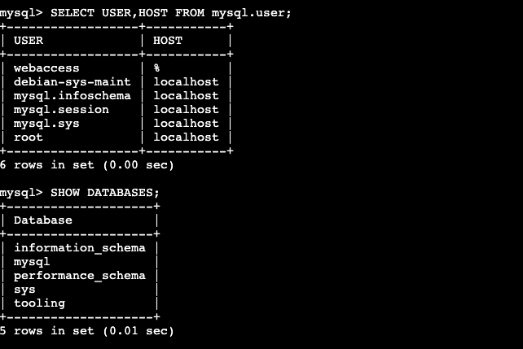

- exit the mysql console

- Edit the bind address to 0.0.0.0
```
sudo vi /etc/mysql/mysql.conf.d/mysqld.cnf
```
- restart mysql
```
sudo systemctl restart mysql
```

### Step 5 - Launch the WebServers

- Launch 3 new EC2 instance with Amazon Linux Operating System and tag it webserver1 webserver2 and webserver3 respectively.


Carry out the following processes on the 3 webservers instances

### Step 6 - Configure NFS Server for Client Access on the 3 websevers

- Intsall NFS client

```
sudo yum install nfs-utils nfs4-acl-tools -y
sudo systemctl start nfs-server
sudo systemctl enable nfs-server
sudo systemctl status nfs-server 
```

- Mount /var/www/ and target the NFS server’s export for apps

```
sudo mkdir /var/www

sudo mount -t nfs -o rw,nosuid <NFS-Server-Private-IP-Address>:/mnt/apps /var/www
```
- Verify the NFS mount:
```
df -h
```

- Edit the fstab 

```
sudo vi /etc/fstab
```

- Added the following line

```
<NFS-Server-Private-IP-Address>:/mnt/apps /var/www nfs defaults 0 0
```
- Verify the mount configuration works and then restart the systemd to pick up changes.
```
sudo mount -a

sudo systemctl daemon-reload
```

### Step 7 - Configure Apache and PHP (Webserver)

- Install Apache and PHP and set a SELinux boolean to allow apache process execute memory as executable

```
sudo yum install httpd -y

sudo systemctl enable httpd 

sudo systemctl start httpd

sudo systemctl status httpd

sudo yum install php php-mysqlnd php-opcache php-gd php-curl php-fpm -y

sudo systemctl start php-fpm

sudo systemctl enable php-fpm

sudo setsebool -P httpd_execmem 1

```

_the image below shows that Apache files and directories are available on the Web Server in /var/www and also on the NFS server in /mnt/apps_

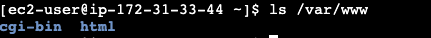

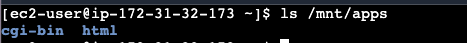

which implies that the NFS was mounted correctly.

### Step 8 - Locate the log folder for Apache on the Web Server and mount it to NFS server’s export for logs (Webserver)

Note: The log folder already contain some content therefore before mounting the directory the folder needs to be backedup in other not to loose the content in it.

- Rename the current log folder

```
sudo mv /var/log/httpd /var/log/httpd.backup
```

- Create a new log httpd folder

```
sudo mkdir /var/log/httpd
```

- Mount the newly created log httpd directory to the NFS server's export for logs.

```
sudo mount -t nfs -o rw,nosuid <NFS-Server-Private-IP-Address>:/mnt/logs /var/log/httpd
```
- Update the fstab to ensure the changes persist after reboot.

```
sudo vi /etc/fstab
```

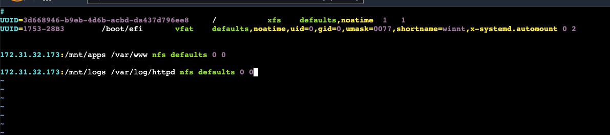

- Verify the mount configuration works and then restart the systemd to pick up changes.
```
sudo mount -a

sudo systemctl daemon-reload
```

- Set permission

```
sudo chown -R root:root /var/log/httpd

sudo chmod -R 700 /var/log/httpd
```

- Copy the content in the httpd.backup folder back to the httpd folder.

```
sudo cp -R /var/log/httpd.backup/. /var/log/httpd
```

### Step 9 - FORK the tooling website source code to your github account and set up git on the webservers

- Next is to fork the tooling website source code [Here](https://github.com/Revelation69/tooling.git)

- Installed git on the webserver
```
sudo yum install git -y
```

### Step 10 - Deploy the tooling website in your webserver

- Deploy the tooling website’s code to the Webserver by cloning the direcotry 

```
git clone https://github.com/Revelation69/tooling.git
```

- Deploy the content of the html folder in the tooling directory to /var/www/html

```
sudo cp -R ~/tooling/html/. /var/www/html
```

- Disable Apache default page

```
sudo mv /etc/httpd/conf.d/welcome.conf /etc/httpd/conf.d/welcome.conf_backup
```

- Grant apache ownership to /var/www/html folder

```
sudo chown -R apache:apache /var/www/html
```

- Disable SELinux 

```
sudo setenforce 0
```

- To make changes permanent disable Selinux (SELINUX=disabled) in the config file 

```
sudo vi /etc/sysconfig/selinux
```


- Restart httpd server to pick up changes.

```
sudo systemctl restart httpd
```

### Step 11 - Intsall Mysql Server (webserver)

Follow these steps to install mysql server on Amazon Linux

- Download the RPM file

```
sudo wget https://dev.mysql.com/get/mysql80-community-release-el9-1.noarch.rpm 
```

- Install RPM file

```
sudo dnf install mysql80-community-release-el9-1.noarch.rpm -y
```

- You need the public key of mysql to install the software.

```
sudo rpm --import https://repo.mysql.com/RPM-GPG-KEY-mysql-2023
```

- Install mysql server

```
sudo dnf install mysql-community-server -y
```

### Step 12 - Configure Web Application Database Connection.

- Update the website configuration file (in /var/www/html/functions.php) to connect to the database.

```
sudo vi /var/www/html/functions.php
```

- fill in the details correctly, db ip address, username, password and database name


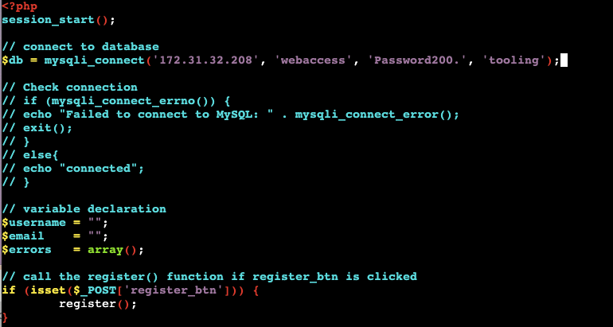


### Step 13 - Adjust SELinux policies to allow specific actions.
```
sudo setsebool -P httpd_can_network_connect=1 
```

_this command sets the SELinux boolean httpd_can_network_connect to 1, enabling the Apache HTTP Server (httpd) process to make network connections. By default, this boolean is usually disabled for security reasons._


```
sudo setsebool -P httpd_can_network_connect_db=1
```
_this command sets the SELinux boolean httpd_can_network_connect_db to 1, allowing the httpd process to make network connections to databases. This is useful if your web application needs to connect to a database server over the network_

```
sudo setsebool -P httpd_execmem=1
```
_this command sets the SELinux boolean httpd_execmem to 1, allowing the httpd process to execute memory as executable._

```
sudo setsebool -P httpd_use_nfs 1
```
_this command sets the SELinux boolean httpd_use_nfs to 1, enabling the httpd process to use NFS (Network File System). This allows Apache to serve files located on NFS-mounted directories._

- Apply tooling-db.sql script to your database using this command mysql -h <databse-private-ip> -u <db-username> -p <db-pasword> < tooling-db.sql


### Step 14 - Connect to the database from the tooling folder

- Change directory to tooling directory

```
cd tooling
```

- connect to your database using `sudo mysql -h <Private-ip-address of your db server> -u webaccess -p tooling < tooling-db.sql`

```
sudo mysql -h 172.31.22.125 -u webaccess -p tooling < tooling-db.sql
```
### Step 15 - Access your tooling website from your browser

- Copy the public ip address of each webserver and paste it in your broswer with /login.php as seen below

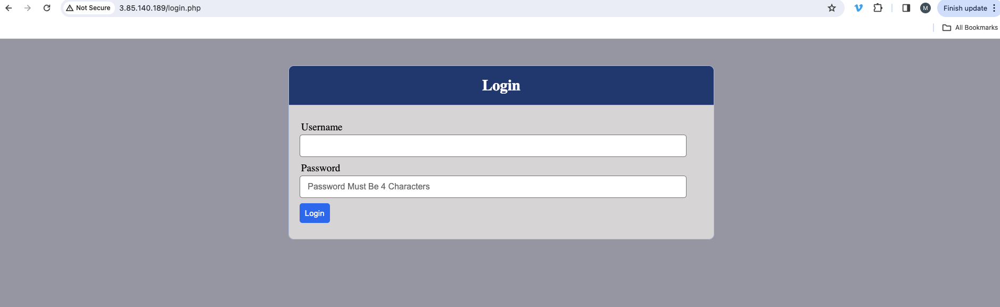

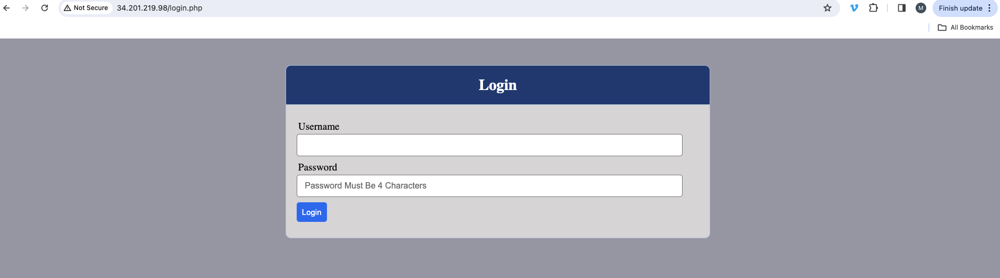

## SET UP A LOAD BALANCER SOLUTION 

We have 3 web servers and each of them have its own public IP address and public DNS name. A client has to access them by using different URLs, which is not a nice user experience to remember addresses/names of even 3 server, let alone millions of Google servers. In order to hide all this complexity and to have a single point of access with a single public IP address/name, a Load Balancer can be used. A Load Balancer (LB) distributes clients’ requests among underlying Web Servers and makes sure that the load is distributed in an optimal way.

The Architecture then looks like this


### Step 16 - Configure Apache as a load balancer

- Pick one of the existing webserver and use as a loadbalancer 

In this case we will utilize the webserver 3 as our loadbalancer server

- we already have apache installed, so let's enable the Proxy Modules and the Headers Module;

```
# Proxy Modules
sudo sed -i '/^#LoadModule proxy_module/s/^#//g' /etc/httpd/conf.modules.d/00-proxy.conf
sudo sed -i '/^#LoadModule proxy_http_module/s/^#//g' /etc/httpd/conf.modules.d/00-proxy.conf

# Headers Module
sudo sed -i '/^#LoadModule headers_module/s/^#//g' /etc/httpd/conf.modules.d/00-base.conf
```

- Restart Apache

```
sudo systemctl restart httpd
```

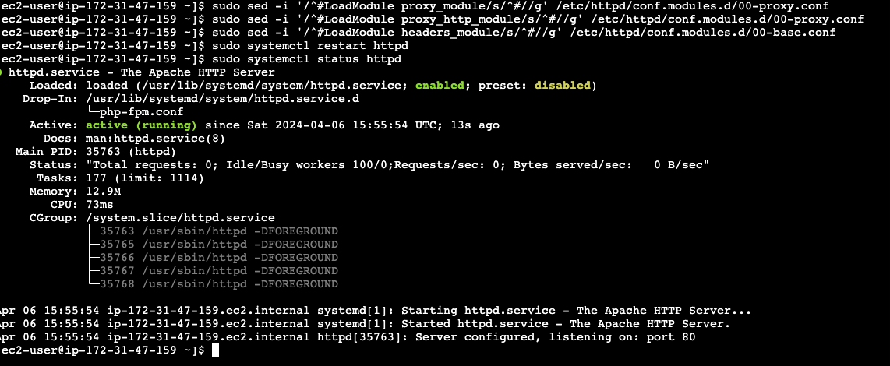

- edit httpd default config file and locate the line that says DocumentRoot

```
sudo vi /etc/httpd/conf/httpd.conf
```

- then Paste the entire load balancing code snippet after the Documentroot

```
<Proxy "balancer://mycluster">
               BalancerMember http://<webserver1-Private-IP-Address>:80 loadfactor=5 timeout=1
               BalancerMember http://<webserver2-Private-IP-Address>:80 loadfactor=5 timeout=1
               ProxySet lbmethod=bytraffic
               # ProxySet lbmethod=byrequests
        </Proxy>

        ProxyPreserveHost On
        ProxyPass / balancer://mycluster/
        ProxyPassReverse / balancer://mycluster/
```

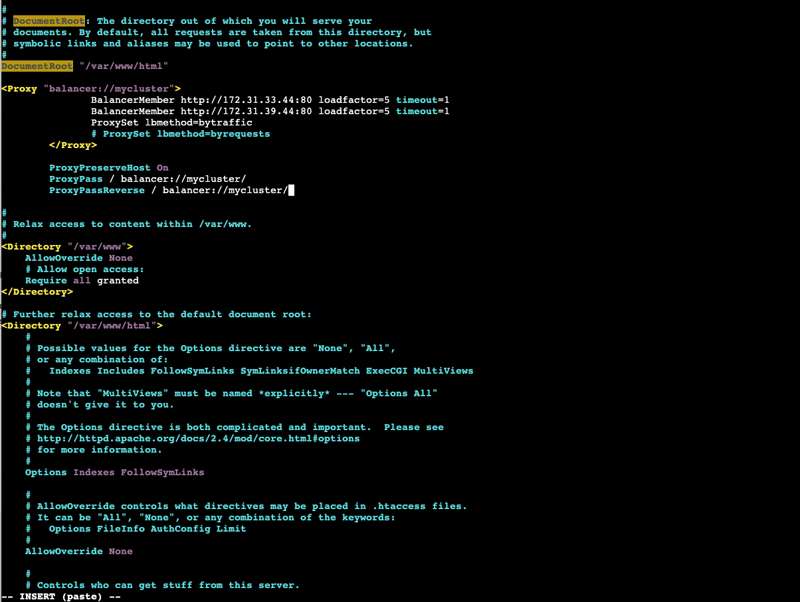

- Create a Virtual host configuration file and paste the basic virtual host configuration into the file

```
sudo vi /etc/httpd/conf.d/tooling.conf
```

```
<VirtualHost *:80>
    ServerName tooling
    ServerAlias <Public-ip-address>
    ServerAdmin webmaster@localhost
    DocumentRoot /var/www/html
    ErrorLog /var/log/httpd/error_log
    CustomLog /var/log/httpd/access_log combined
</VirtualHost>
```

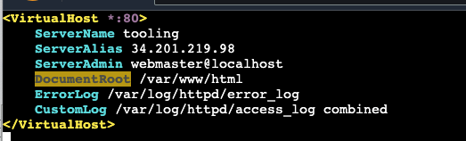

- Restart the Apache server

```
sudo systemctl restart httpd
```

- Access the public ip address of the load balancer server 

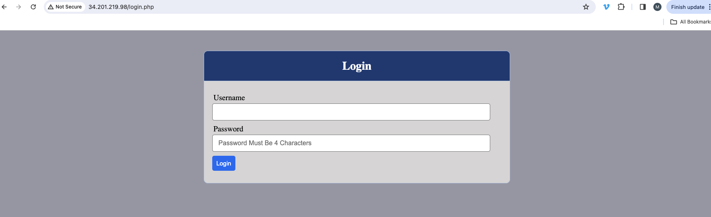

### Step 17 - Unmount the log direcotry from the web server to the NFS Server

- Unmount /var/log/httpd from the web server to the NFS server

```
sudo umount -f /var/log/http
```

- Call the log directory of webserver1 and webserver2

- Then make request to your load balancer server from the browser and watch how the log of both webserver increases, which implies that the load balancer is distributing request evenly accross the web servers. 

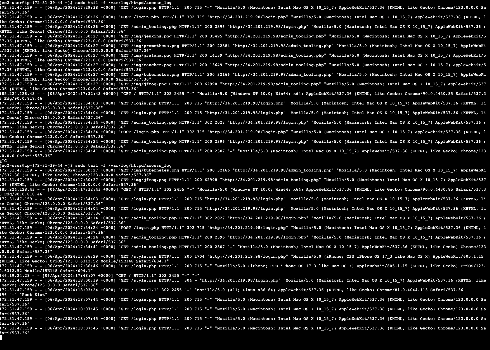

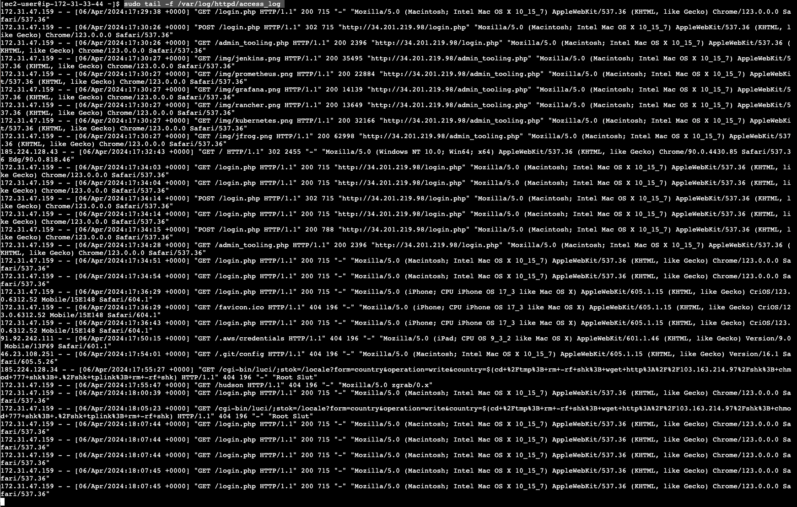

### CONCLUSION

This project demonstrates the implementation of a scalable architecture for hosting web applications on AWS. By leveraging AWS services such as EC2, EBS, NFS, and Load Balancer, the project achieves a highly available and fault-tolerant infrastructure.

The use of a three-tier architecture ensures separation of concerns, with web servers handling client requests, a dedicated database server managing data storage and retrieval, and an NFS server providing shared file storage for application files and logs.

Throughout the implementation, considerations for security, performance, and ease of management are addressed. SELinux policies are adjusted to allow necessary actions, permissions are set appropriately, and best practices for AWS resource configuration are followed.

Overall, the project provides a comprehensive guide for deploying scalable web applications on AWS, catering to the needs of modern web applications that require high availability, scalability, and reliability.

**PROJECT COMPLETED**