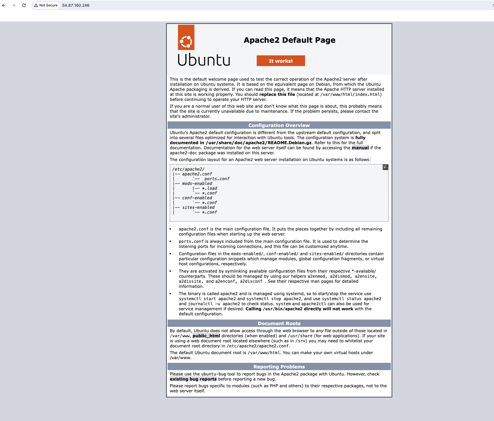

# How To Install Linux, Apache, MySQL, PHP (LAMP) Stack on Ubuntu 22.04


## Project Overview: 

This project aims to develop a web-based application using the LAMP stack. The LAMP (Linux, Apache, MySQL, PHP/Perl/Python) stack is a popular open-source web development platform used for building dynamic websites and web applications. 

## Prerequisites:
- AWS EC2 Instance: An EC2 instance will be used as the hosting environment for the LAMP stack. It provides scalability and flexibility for web development projects.

- AWS Security Group Configuration: Ensure that all traffic is allowed in the AWS Security Group associated with your EC2 instance. However, this is not a recommended practice for production environments, and security configurations should be adjusted accordingly.

- Choose Ubuntu OS: Select Ubuntu as the operating system when configuring your EC2 instance. Ubuntu is widely used and well-supported, making it a suitable choice for hosting web applications.

## Step-by-Step Implementation:

### Step 1 - Installing Apache 

- Update package manager

```
sudo apt update
```

- Install Apache2 webserver:

```
sudo apt install apache2
```

You’ll be prompted to confirm Apache’s installation. Confirm by pressing Y, then ENTER.

- After installation, verify the status of Apache:

```
sudo systemctl status apache2
```


- Test Apache's installation by accessing your server’s public IP address in your web browser:

```
http://your_server_ip
```



### Step 2 — Installing MySQL

Now that Apache web server is up and running, a database system needs to be installed to store and manage data for your site. MySQL is a popular database management system used within PHP environments.

- Install MySQL Server:

```
sudo apt install mysql-server
```

When prompted, confirm installation by typing Y, and then ENTER.

When the installation is finished, it’s recommended that you run a security script that comes pre-installed with MySQL. This script will remove some insecure default settings and lock down access to your database system.

- Open up MYSQL Prompt

```
sudo mysql
```

- Then run the following **ALTER USER** command to change the root user’s authentication method to one that uses a password. The following example changes the authentication method to **mysql_native_password**:

```
ALTER USER 'root'@'localhost' IDENTIFIED WITH mysql_native_password BY 'password';
```

- After making this change, exit the MySQL prompt:

```
exit
```

- Start the interactive script by running:

```
sudo mysql_secure_installation
```

This will ask if you want to configure the **VALIDATE PASSWORD PLUGIN**.

Note: Enabling this feature is something of a judgment call. If enabled, passwords which don’t match the specified criteria will be rejected by MySQL with an error. It is safe to leave validation disabled, but you should always use strong, unique passwords for database credentials.

When prompted, confirm installation by typing Y, and then ENTER to series of question regarding removal of anonymous user and test database.


### Step 3 — Installing PHP

Having installed Apache to serve content and MySQL to store and manage data, PHP is next component of which processes code to display dynamic content to the end user. In addition to the php package, we will install php-mysql, a PHP module that allows PHP to communicate with MySQL-based databases and also install libapache2-mod-php to enable Apache to handle PHP files.

- To install these packages, run the following command:

```
sudo apt install php libapache2-mod-php php-mysql
```

- After installation, verify the PHP version:

```
php -v
```

**Output**


LAMP stack is now fully operational, but before testing the setup with a PHP script, it’s best to set up a proper Apache Virtual Host to hold your website’s files and folders.


### Step 4 — Creating a Virtual Host for your Website

When using the Apache web server, you can create virtual hosts to encapsulate configuration details and host more than one domain from a single server. we’ll set up a domain called lamp.

Apache on Ubuntu 22.04 has one virtual host enabled by default that is configured to serve documents from the /var/www/html directory. While this works well for a single site, it can become unwieldy if you are hosting multiple sites. Instead of modifying /var/www/html, we’ll create a directory structure within /var/www for the lamp site, leaving /var/www/html in place as the default directory to be served if a client request doesn’t match any other sites.

- Create the directory for Lamp domain as follows:

```
sudo mkdir /var/www/lamp
```

- Next, assign ownership of the directory with the $USER environment variable, which will reference your current system user:

```
sudo chown -R $USER:$USER /var/www/lamp
```

- Then, open a new configuration file in Apache’s sites-available directory using your preferred command-line editor. Here, we’ll use vim:

```
sudo vim /etc/apache2/sites-available/lamp.conf
```

- This will create a new blank file. Add in the following bare-bones configuration with your own domain name: 

```
<VirtualHost *:80>
    ServerName your_domain
    ServerAlias www.your_domain
    ServerAdmin webmaster@localhost
    DocumentRoot /var/www/your_domain
    ErrorLog ${APACHE_LOG_DIR}/error.log
    CustomLog ${APACHE_LOG_DIR}/access.log combined
</VirtualHost>
```


Save and close the file when you’re done. If you’re using vim, do that by pressing escape, :wq then ENTER.

- Now, use a2ensite to enable the new virtual host:

```
sudo a2ensite lamp
```

- Disable the default website that comes installed with Apache. This is required if you’re not using a custom domain name, because in this case Apache’s default configuration would override your virtual host. To disable Apache’s default website, run:

```
sudo a2dissite 000-default
```

- To make sure your configuration file doesn’t contain syntax errors, run the following command:

```
sudo apache2ctl configtest
```

- Finally, reload Apache so these changes take effect:

```
sudo systemctl reload apache2
```


Your new website is now active, but the web root /var/www/lamp is still empty. Create an index.html file in that location to test that the virtual host works as expected:

```
sudo vi /var/www/lamp/index.html
```

- Enter the below and save

```
<html>
  <head>
    <title>lamp website</title>
  </head>
  <body>
    <h1>Hello World! Testing Lamp Website</h1>

    <p>This is the landing page of <strong>lamp</strong>.</p>
  </body>
</html>
~       
```

- Go to your browser and access your server’s domain name or IP address:


Your web page should reflect the contents in the file you just edited:


### Step 5 — Testing PHP Processing on your Web Server

Now that you have a custom location to host your website’s files and folders, create a PHP test script to confirm that Apache is able to handle and process requests for PHP files.

- Create a new file named info.php inside your custom web root folder:

```
sudo vi /var/www/lamp/info.php
```

- Add the following text, which is valid PHP code, inside the file:

```
<?php
phpinfo();
```

When you are done, save and close the file.

To test this script, go to your web browser and access your server’s domain name or IP address, followed by the script name, which in this case is info.php:

```http://<public-ip-address>/info.php```

Here is an example of the default PHP web page:


This page provides information about your server from the perspective of PHP. It is useful for debugging and to ensure that your settings are being applied correctly.

If you see this page in your browser, then your PHP installation is working as expected.

After checking the relevant information about your PHP server through that page, it’s best to remove the file you created as it contains sensitive information about your PHP environment and your Ubuntu server. Use rm to do so:

```
sudo rm /var/www/lamp/info.php
```

You can always recreate this page if you need to access the information again later.

### Step 6 — Testing Database Connection from PHP (Optional)

If you want to test whether PHP is able to connect to MySQL and execute database queries, you can create a test table with test data and query for its contents from a PHP script. Before you do that, you need to create a test database and a new MySQL user properly configured to access it.

Create a database named lamp_database and a user named lamp_user. You can replace these names with different values.

- First, connect to the MySQL console using the root account:

```
sudo mysql
```

- To create a new database, run the following command from your MySQL console:

```
CREATE DATABASE lamp_database;
```

- Now create a new user and grant them full privileges on the custom database you’ve just created.

The following command creates a new user named lamp_user that authenticates with the caching_sha2_password method. We’re defining this user’s password as password, but you can replace this value with a secure password of your own choosing.

```
CREATE USER 'lamp_user'@'%' IDENTIFIED BY 'password';
```

- Now give this user permission over the lamp_database database:

```
GRANT ALL ON lamp_database.* TO 'lamp_user'@'%';
```

This will give the lamp_user user full privileges over the lamp_database database, while preventing this user from creating or modifying other databases on your server.

- Now exit the MySQL shell with

```
exit
```

- Test if the new user has the proper permissions by logging in to the MySQL console again, this time using the custom user credentials:

```
mysql -u lamp_user -p
```

Notice the -p flag in this command, which will prompt you for the password used when creating the lamp_user user. 

- After logging in to the MySQL console, confirm that you have access to the lamp_database database:

```
SHOW DATABASES;
```

- This will give you the following output:


- Next, create a test table named todo_list. From the MySQL console, run the following statement:


```
CREATE TABLE lamp_database.todo_list (
  item_id INT AUTO_INCREMENT,
  content VARCHAR(255),
  PRIMARY KEY(item_id)
);
```

- Insert a few rows of content in the test table. Repeat the next command a few times, using different values, to populate your test table:

```
INSERT INTO lamp_database.todo_list (content) VALUES ("My first important item");
```

- To confirm that the data was successfully saved to your table, run:

```
SELECT * FROM lamp_database.todo_list;
```

The following is the output:


- After confirming that you have valid data in your test table, exit the MySQL console:

```
exit
```

- Create the PHP script that will connect to the MySQL database and ueries for the content of the todo_list table.

```
sudo vi /var/www/lamp/todo_list.php
```

The following PHP script connects to the MySQL database and queries for the content of the todo_list table, exhibiting the results in a list. If there’s a problem with the database connection, it will throw an exception.

- Add this content into the todo_list.php script:


```
<?php
$user = "lamp_user";
$password = "password";
$database = "lamp_database";
$table = "todo_list";

try {
  $db = new PDO("mysql:host=localhost;dbname=$database", $user, $password);
  echo "<h2>TODO</h2><ol>";
  foreach($db->query("SELECT content FROM $table") as $row) {
    echo "<li>" . $row['content'] . "</li>";
  }
  echo "</ol>";
} catch (PDOException $e) {
    print "Error!: " . $e->getMessage() . "<br/>";
    die();
}
```

Save and close the file when you’re done editing.

You can now access this page in your web browser by visiting the domain name or public IP address configured for your website, followed by /todo_list.php:

```
http://your_domain_or_IP/todo_list.php
```

This web page should reveal the content you’ve inserted in your test table to your visitor:


That means your PHP environment is ready to connect and interact with your MySQL server.

Conclusion

In this guide, we’ve built a flexible foundation for serving PHP websites and applications using the LAMP stack on Ubuntu 22.04. Each component—Linux, Apache, MySQL, and PHP—plays a critical role in web development, and with this setup, we have a robust environment to host and develop dynamic web applications. 

**PROJECT COMPLETED**